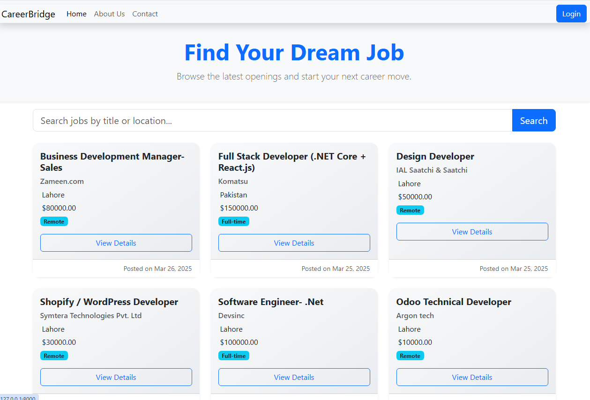
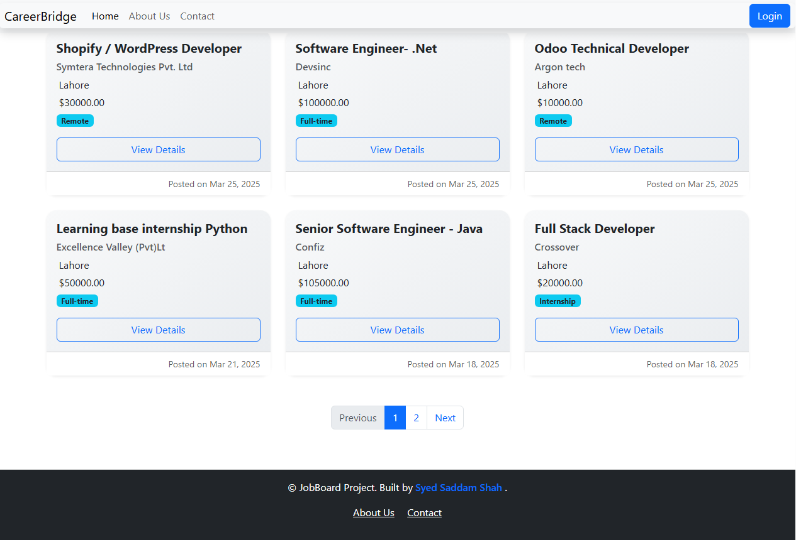
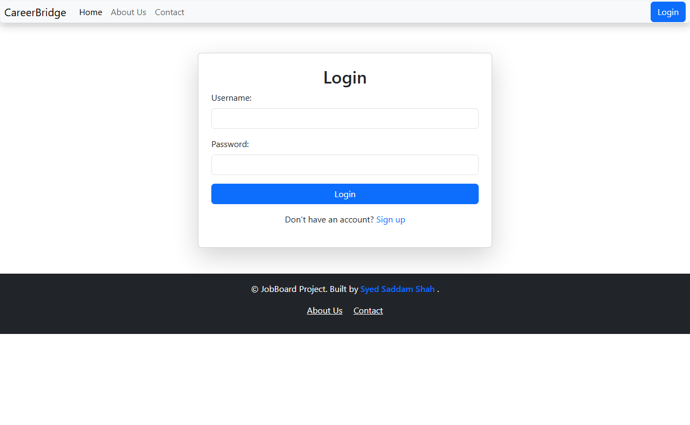
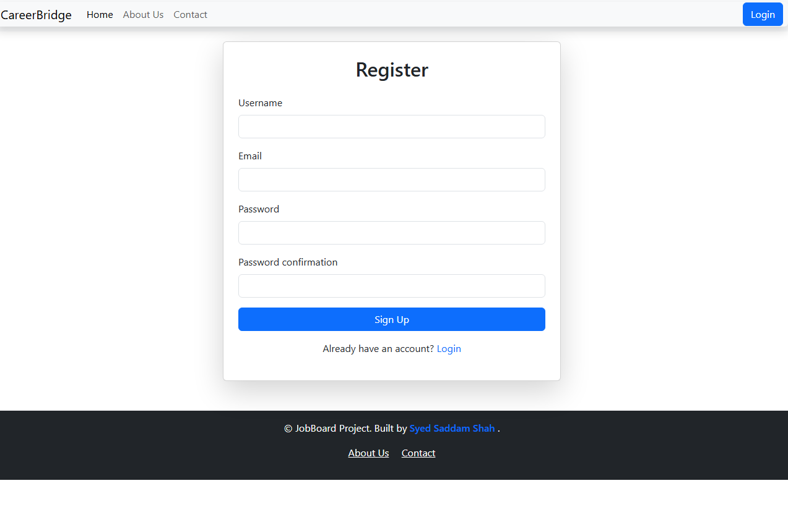
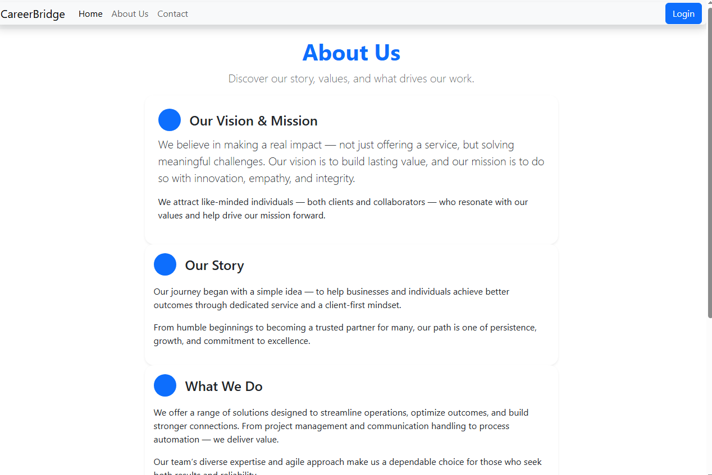

# 🧳 # CareerBridge – Django Job Listing & Application System

A fully functional **role-based Job Board web application** built with Django. This app enables HR users to post job openings and manage applicants, while general users (job seekers) can apply for jobs using uploaded resumes. The system uses custom authentication and provides separate dashboards and permissions for each user type.

---

## 📌 Key Features

### 👥 Authentication & Role Management
- 🔐 Custom user model with two roles: `user` and `hr`
- ✅ Registration, login, and logout
- 🧭 Role-based redirection and dashboards
- 🔄 Session handling and flash messages

### 💼 Jobs (HR Access)
- ✍️ Create, update, and delete job posts
- 👁️ View job applicants
- 🛠️ HR-only job dashboard

### 📄 Applications (User Access)
- 🔎 Browse job listings
- 📤 Apply to jobs with resume upload
- 📑 Track own job applications

### 🎨 UI/UX
- 🔧 Bootstrap 5 responsive frontend
- 📩 Django messages framework integration
- 🎯 Dynamic navbar/menu based on user role

---

## 🗂️ Project Structure

job_portal/ ├── accounts/ # Handles auth and user roles │ ├── models.py # CustomUser with role field │ ├── views.py # Login, register, dashboard │ ├── urls.py │ └── templates/accounts/ │ ├── login.html │ ├── register.html │ └── dashboard.html

├── jobs/ # Job posting & applications │ ├── models.py # Job, Application models │ ├── views.py # Job views and apply logic │ ├── urls.py │ └── templates/jobs/ │ ├── job_list.html │ ├── job_detail.html │ ├── post_job.html

├── templates/ │ ├── base.html # Shared layout │ └── home.html

├── static/ # Static CSS/JS ├── media/ # Uploaded resumes ├── db.sqlite3 # Default DB (for dev) ├── manage.py ├── requirements.txt └── README.md

---

## 🛠️ Tech Stack

- **Backend**: Django 4.x
- **Frontend**: Bootstrap 5, HTML, CSS
- **Database**: SQLite (can be changed to PostgreSQL for production)
- **Authentication**: Django's built-in user model with custom roles


## 🛠️ Installation & Setup

### 🧰 Requirements

- Python 3.8+
- Django 4.x
- Virtualenv (recommended)


### 🚀 Setup Instructions

```bash
# Clone the repository
git clone https://github.com/your-username/django-job-board.git
cd django-job-board

# Create and activate virtual environment
python -m venv env
source env/bin/activate         # Windows: env\Scripts\activate

# Install dependencies
pip install -r requirements.txt

# Apply migrations
python manage.py makemigrations
python manage.py migrate

# Create a superuser (for admin access)
python manage.py createsuperuser

# Run the development server
python manage.py runserver
Then open your browser and visit: http://127.0.0.1:8000/

```

## 👨‍💼 Admin Panel

- URL: `http://127.0.0.1:8000/admin/`
- Use the superuser credentials to login.

### ⚙️ Configuration
settings.py
python
Copy
Edit
MEDIA_URL = '/media/'
MEDIA_ROOT = BASE_DIR / 'media'

STATIC_URL = '/static/'
<<<<<<< HEAD
STATICFILES_DIRS = [BASE_DIR / 'static']
urls.py (project-level)
=======
STATICFILES_DIRS = [ BASE_DIR / 'static']
urls.py (project-level):
>>>>>>> 5f136db (Frontend work added)
python
Copy
Edit
from django.conf import settings
from django.conf.urls.static import static

urlpatterns = [
    path('accounts/', include('accounts.urls')),
    path('', include('jobs.urls')),
]

if settings.DEBUG:
    urlpatterns += static(settings.MEDIA_URL, document_root=settings.MEDIA_ROOT)
    
```
```

### 🔐 Roles & Permissions
Role	Description
user	View job listings, apply with resume
hr	Post, edit, and delete jobs, view applicants
admin	Full access via Django admin panel

```
```
### 🧪 Sample Test Accounts
Role	Email	Password
HR	hr@example.com	hr1234
User	user@example.com	user1234
Admin	Created via createsuperuser	

```
```

### 💡 Sample URLs
URL	View	Purpose
/	job_list	Homepage with jobs
/accounts/login/	custom_login	Login form
/accounts/register/	register	Registration for users
/accounts/dashboard/	dashboard	Role-based dashboard
/post-job/	post_job (HR only)	Post a new job
/job/<int:id>/	job_detail	View job detail & apply form

```
```

### 📸 Screenshots








```
```
### 📦 requirements.txt Sample

Django==4.2.7
To regenerate:


pip freeze > requirements.txt

```
```
### 📃 License

This project is intended for educational purposes. You are welcome to use and modify it as needed.

```
```

### 🙌 Credits

Developed by Syed Saddam Shah

🔗 GitHub Repo
👉 Click to view the repo


---

